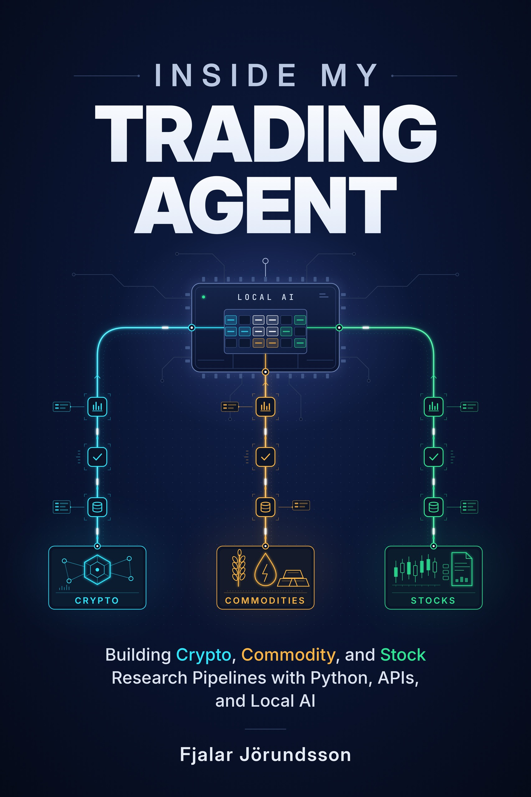
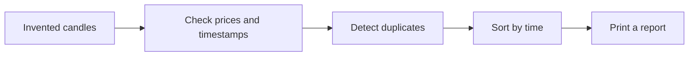

# Inside My Trading Agent

### Three markets. One personal project. A lot of learning along the way.

**Building Crypto, Commodity, and Stock Research Pipelines with Python, APIs, and Local AI**
By **Fjalar Jörundsson**

<p align="center">
  
</p>

What happens when you take an idea, a home computer, and an AI coding assistant—and keep building?

I built a system with three research pipelines: crypto, commodities, and stocks. Along the way, I learned about market data, local AI, testing, and the small details that decide whether a system does what you intended. *Inside My Trading Agent* is my account of that experience, including the decisions, experiments, and mistakes that taught me the most.

**This repository is the free, hands-on companion to the book.** Start with a small Python exercise that works offline, then try a repeatable benchmark for a local language model. You can use these examples without buying the book.

[Try the first exercise](#your-first-10-minutes) · [Explore the book](#inside-the-book) · [Benchmark a local model](#try-a-local-ai-benchmark)

## Who is this for?

If you have basic Python knowledge—or are comfortable using Codex, Claude Code, or another AI coding assistant to explore code—this is a place to start.

You might enjoy the book if you want to:

- Turn a personal idea into a working software project with AI coding tools.
- Understand how market APIs, data checks, and research pipelines fit together.
- Explore what it means to run Qwen on your own computer.
- Learn from a real project before designing your own.

## Inside the book

The book follows the project from the first building blocks to automation and lessons learned. It includes diagrams, API tables, examples of prompts, and an introduction to candlestick charts.

| Part of the project | What I explore |
|---|---|
| **Crypto** | Building a pipeline around crypto market data and its particular demands. |
| **Commodities** | Working with another market and adapting the research approach. |
| **Stocks** | Bringing together prices, company information, and news. |
| **APIs and data** | Choosing free and paid sources, validating inputs, and handling missing information. |
| **Local Qwen** | How my workstation runs the model, what I ask it to do, and how I measure its responses. |
| **AI-assisted development** | Breaking ideas into manageable changes, inspecting generated code, and testing it. |
| **Automation** | Making repeated runs understandable and recovering when something goes wrong. |

The complete trading system remains a separate personal project. The code here consists of small teaching examples you can read, run, and change.

## Your first 10 minutes

**You need Python 3.9 or newer.** The first exercise needs no API keys, accounts, model downloads, or third-party Python packages.

Download the repository using **Code → Download ZIP** and extract it, or clone it:

```bash
git clone https://github.com/fjalarjorundsson-arch/inside-my-trading-agent-companion.git
cd inside-my-trading-agent-companion
```

Open a terminal in the extracted or cloned folder and run:

```bash
python starter_report.py
```

On Windows, you can use `py` instead of `python`. On macOS or Linux, you may need `python3`.

You should see:

```text
SYNTHETIC DATA - not market observations
Valid candles:    3
Rejected rows:    0
First close (UTC): 2030-01-07T16:00:00+00:00
Last close (UTC):  2030-01-09T16:00:00+00:00
Close-to-close:   4.90%
```

The script checks invented OHLC candles, detects duplicate timestamps, sorts records by their actual time, and calculates the change between the first and last closing prices. The percentage above is an example calculation using fictional data.



**Now change something.** In `SYNTHETIC_CANDLES`, set the first candle's `high` to `100.0` and run the script again. That row should be rejected because its high is below its open and close. Restore the original value, then run the tests:

```bash
python -m unittest -v test_starter_report.py
```

All 10 tests should pass. They cover invalid prices, missing timezones, duplicate instants, and input ordering.

### A prompt to try with your coding assistant

> Read starter_report.py and its tests. Explain how the script decides whether a candle is valid. Then propose one small improvement and a test that demonstrates why it matters. Show me your reasoning before changing the code. Keep the exercise offline and use only Python's standard library.

## Try a local AI benchmark

Already running a local model? The second exercise sends the same fictional evidence package repeatedly and records how the model responds.

You need a running **local OpenAI-compatible server**, such as LM Studio, with a model loaded. The default server address is `http://127.0.0.1:1234/v1`. Model downloads and the model server are separate from this repository.

Replace `YOUR_LOADED_MODEL_ID` with the exact model identifier exposed by your server:

```bash
python benchmark_local_model.py --model YOUR_LOADED_MODEL_ID --runs 10 --out results.csv
```

The script performs one warm-up request followed by the measured runs. It writes a CSV and reports:

- Total response time and time to first token.
- Token counts and generation speed when the server supplies usage data.
- Whether the answer contains valid JSON, an allowed verdict, and recognised evidence IDs.

This is a starting point for comparing local configurations. The answer checks are limited: passing them does not establish that the model's reasoning is correct. The script does not measure VRAM or power consumption. Requests are restricted to the local server.

## Files at a glance

| File | What it does | Book section |
|---|---|---|
| [starter_report.py](starter_report.py) | Validates fictional candles and prints a report. | Appendix B |
| [test_starter_report.py](test_starter_report.py) | Checks the starter exercise's behaviour. | Appendix B |
| [benchmark_local_model.py](benchmark_local_model.py) | Measures repeatable requests to a local model. | Chapter 13 |

## About me

I grew up in a small fishing village in Iceland's Westfjords. My first encounter with programming came with a Sinclair ZX Spectrum and its BASIC book: type something in, change it, and see what happens.

I later earned a bachelor's degree in computer science. Today, I'm a father of five, and AI coding tools have given me a new way to turn a long list of ideas into things that actually run. This book tells the story of one of them.

— **Fjalar Jörundsson**

## Questions and feedback

Tried an exercise? Found something unclear? [Open an issue](https://github.com/fjalarjorundsson-arch/inside-my-trading-agent-companion/issues) with the command you ran, what you expected, and what happened. Please leave out API keys and private account information.

If these examples are useful, a star helps other readers find the project.

## Licence and scope

The companion code is available under the [MIT licence](LICENSE). The book and cover artwork are not included in that licence; copyright remains with Fjalar Jörundsson.

All example prices, timestamps, companies, and evidence are synthetic. These exercises cannot place orders and are provided for learning, not as investment advice.
